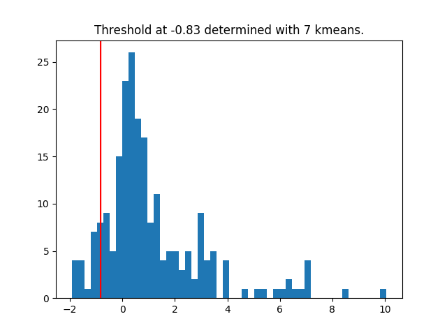

# Distribution of TWC results

This is a small script that draws a simple distribution from a TwinCons RiboVision csv output and identifies outlying scores at X standard deviations away from the mean.

Sample command:

> ./bin/twcDist.py ./data/TWC_blastn_AB_LSUa.csv ./output/PNG/TWC_blastn_AB_LSUa.png ./output/CSV/TWC_blastn_AB_LSUa.csv

First argument is the input, second is the path for image output, and third is the path for csv output of outliers.

Sample output:

